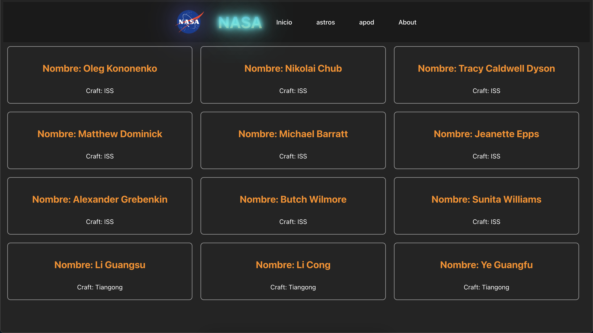
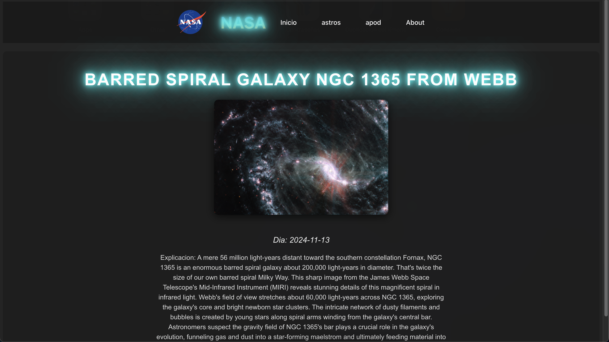

# React + Vite

## REACT APP 

Currently, two official plugins are available:

- [@vitejs/plugin-react](https://github.com/vitejs/vite-plugin-react/blob/main/packages/plugin-react/README.md) uses [Babel](https://babeljs.io/) for Fast Refresh
- [@vitejs/plugin-react-swc](https://github.com/vitejs/vite-plugin-react-swc) uses [SWC](https://swc.rs/) for Fast Refresh

<h1>Página creada como prueba de REACT NASA</h1>

  
  
  
  

